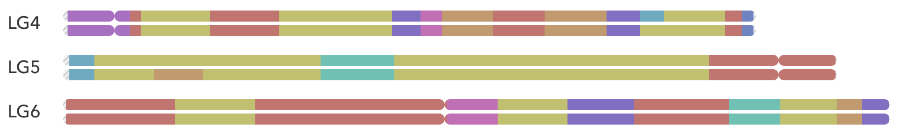

fish\_pedigree - Pedigree Chromosome Drawer

[](https://travis-ci.org/pseudogene/fish_pedigree) [](https://www.codacy.com/manual/pseudogene/fish_pedigree?utm_source=github.com&amp;utm_medium=referral&amp;utm_content=pseudogene/fish_pedigree&amp;utm_campaign=Badge_Grade)

# Fish-Pedigree

Fish-Pedigree is a set of Python3 scripts able to draw publication-ready vectorial chromosomes for pedigree and local ancestry inferance.

## Description

Set of Python 3 scripts for creating a publication-ready vectorial chromosomes in Scalable Vector Graphics (SVG) format. The resulting file can either be submitted for publication and edited with any vectorial drawing software like [Inkscape](https://inkscape.org/) and [Abobe Illustrator(R)](https://www.adobe.com/uk/products/illustrator.html).

The necessary input files are a VCF file with SNP aligned to a reference genome, the reference genome (FASTA formatted) and the list of samples.

## Installation

```sh
git clone https://github.com/pseudogene/fish_pedigree.git
cd fish_pedigree
python3 setup.py install
```

## Usage

### `make_karyotype.py`

The core script need to establish the length and structure of the genome, the script `make_karyotype.py` used the genome sequence (FASTA) used to aligned the SNP and create a BED file with the chromsosme structure.

```plaintext
Usage: make_karyotype.py --fasta FASTA [--circos]

Arguments:
  --fasta FASTA, -i FASTA
       Path to the genome file (FASTA format)
  --circos
       Format for CIRCOS rather than normal BED format

Example:
  make_karyotype.py --fasta tilapia_GCF_001858045.2.fasta > tilapia.bed
```

### `vcf2map.py`

The script relaised on [RFmix](https://github.com/slowkoni/rfmix) to generate the Ancestry inferences. [RFmix](https://github.com/slowkoni/rfmix) requires a generic map. This _pseudo_-map can be generated from the alignement of the genome using this script: each chromosome length is rescaled from 1 to 100 and the markers/SNP position are located on this new ordinate system.

```plaintext
Usage: vcf2map.py --vcf VCF

Arguments
  --vcf VCF -i VCF
       Path to the VCF file aligned with the reference genome

Example:
  vcf2map.py --vcf tilapia_SNP.vcf > map.txt
```

### `map_chr.py`

Following the run with [RFmix](https://github.com/slowkoni/rfmix), this script generate a meaning full output or visualisation.

```plaintext
Usage: map_chr.py --karyotype KARYOTYPE
                  [--msp MSP]
                  [--fb FB] [--t THRESHOLD]
                  [--chr CHRM] [--sample SAMPLE]
                  [--prefix PREFIX]
                  [--html] [--nojs]

Arguments:
  --msp MSP
        Path to RFmix MSP output
  --fb FB
        Path to RFmix FB output
  --t THRESHOLD
        Threshold for identification (use with FB file)
  --karyotype KARYOTYPE
       Path to the karyotype file (BED format)
  --chr CHRM
        Include only the specified chromosome
  --sample SAMPLE
        Include only the specified sample
  --prefix PREFIX
        Output prefix
  --html
        Output HTML format rather than BED format
  --nojs
        No dynamic HTML

Example:
  map_chr.py --msp tilapia.msp.tsv --karyotype tilapia.bed --html
  map_chr.py --fb tilapia.fb.tsv --t 0.75 --karyotype tilapia.bed --html --nojs
```



## Pipeline examples

```sh
# Distribution test
map_chr.py --k examples/O_niloticus.bed --msp examples/O_niloticus.msp.tsv --html --prefix example
```

```sh
# Given snp.vcf (10 samples: 5 queries, 5 references), genome.fasta and sample_list.txt

make_karyotype.py --fasta genome.fasta > my_genome.bed
vcf2map.py --vcf snp.vcf > my_map.txt

# External software: BEAGLE
java -Xmx30688m -jar beagle.jar gt=snp.vcf out=phased

cut -f1-9,10-14 phased.vcf > query.vcf
cut -f1-9,15-19 phased.vcf > reference.vcf

# Externale software RFMIX
rfmix -f query.vcf -r reference.vcf -m sample_list.txt -g my_map.txt -o output --chromosome=chr1

map_chr.py --msp output.msp.tsv --karyotype my_genome.bed --html
```


## How to cite fish\_pedigree

>Avallone, A., Bartie, K.L., Selly, S.-L.C., Taslima, K. Campos Mendoza, A., Bekaert, M.
>**Local ancestry inference provides insight into Tilapia breeding programmes**.
>_Sci Rep_, **10**, 18613 (2020).

[](http://dx.doi.org/10.1038/s41598-020-75744-9)


## License
The content of this project itself is licensed under the [Creative Commons Attribution-ShareAlike 4.0 International License](http://creativecommons.org/licenses/by-sa/4.0/), and the source code presented is licensed under the [GPLv3 license](http://www.gnu.org/licenses/gpl-3.0.html).
